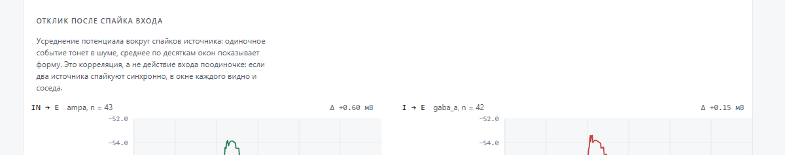

# VNL — a language for describing neural microcircuits

**English** · [Русский](README.ru.md)

You write the model as text. A `.vnl` file is parsed into an IR, and the IR goes
out to backends: a point-neuron simulator for fast work, and a NetPyNE/NEURON
script for the biophysics. No Hodgkin–Huxley solver of our own is being written,
and none will be.

```
   .vnl  ──►  AST  ──►  IR  ──┬──►  L1: точечный симулятор (чистый Python)
                              ├──►  L2: скрипт NetPyNE → NEURON
                              ├──►  HTML: схема (раскладка ELK), растр, трассы
                              ├──►  JSON ──► интерфейс (React, ui/)
                              └──►  граф в DOT
```

> The tool itself speaks Russian: diagnostics, page labels and reports come out
> in Russian, and the screenshots below show that. Only the documentation is
> translated.


Everything in that picture is drawn from the source. A circle is an excitatory
cell, a square an inhibitory one. Dendrites fan out to the left, the axon runs
right as a dashed line. The green dot sits exactly where the contact landed:
`E.dend.apical[1]@0.6`. The red bar at the soma is inhibition.

## Running it

```bash
pip install -e .[dev]

vnl check  examples/ffi.vnl
vnl run    examples/ffi.vnl --traces out.csv
vnl view   examples/ffi.vnl --open          # схема, растр и трассы в браузере
vnl export examples/ffi.vnl -o ffi.netpyne.py
vnl graph  examples/disinhibition.vnl -o circuit.dot
```

`vnl run` prints a raster straight into the terminal:

```
IN ......|.|.|||||.||||.|.||||.|..||||||..|||.||.|....|.|.||||.|||.|....|.||.....
 E ...........|..|....|................|.....|...................|...............
 I ......||.||||||.||.|..||.||.|...||.||..||||||.|.....||.||||..||.|.....|||.....
   0                                                                      400 мс
```

## The run page

`vnl view` builds a single self-contained HTML file. Print it, attach it to a
ticket, open it with nothing installed. There are no scripts inside, only SVG
and CSS. Three blocks: the circuit, network activity, and traces.


Network activity is the overview: one track per cell, spike strokes, the
membrane potential underneath, and a grey band marking when a stimulus was
running. It grows by rows rather than by packing, so a new cell takes no room
away from the others.


In the traces block each kind of recording is presented on its own terms. The
potential gets a threshold line, conductance counts from zero and is filled in,
weight reports where it started and where it ended, and spikes are strokes
instead of a curve.

The page has one time axis. The «100 мс» tick in network activity and in the
traces sits on the same vertical, so the blocks read one under another. Styling
follows the Reckue design system (`design/reckue/`); light and dark themes are
both there.

### ELK does the layout

Placing cells and routing connections is a problem of its own, and there is no
reason to solve it by hand: hand-rolled curves start merging at the third
contact. `vnl.layout` assembles a graph with ports and hands it to
[ELK Layered](https://eclipse.dev/elk/) through Node; `vnl.report` only draws
the polylines it gets back.

ELK was chosen for its `FIXED_POS` ports: they bring a connection to the exact
point on the dendrite where the contact is declared. Graphviz with
`splines=ortho` cannot do that.

```bash
npm install --prefix tools/layout elkjs
```


The same engine on a VIP ⊣ SST ⊣ PYR chain. The amber dashed line is the
neuromodulator, and it runs to the contact it governs.

Without Node and elkjs everything still works: the layout falls back to the
built-in layered one and the page says so. Pick the engine with
`--layout elk|builtin|auto`.

## The interface

When you need to work out causality, a page is not enough. The interface lives
in `ui/` and reads the same run as JSON:

```bash
vnl data examples/ffi.vnl -o ui/public/run.json
cd ui && npm install && npm run dev
```


The first screen is the neuron inspector: inputs with their contact site and
parameters, membrane potential against the threshold, excitatory and inhibitory
conductance apart, and the balance between them. One time cursor serves every
plot, and the values under it stay in the header.



Averaging around the source's spikes answers the question «what does this input
do to the cell». The caption under the plot warns you: this is correlation, not
what the input does on its own. When two sources fire in sync, each one's window
shows the neighbour too.

Built on Vite and React, without Next: a local tool needs neither SSR nor server
routing, and it reads a finished run from a file. The exchange format is
described in `src/vnl/api.py`, its TypeScript mirror in
`ui/src/model/types.ts`. Change them together or not at all.

### The pattern library

A finished microcircuit is saved as a pattern and later inserted into another
schema as a block with ports. The library and the sandboxes are files under
`.vnl/`, and the interface talks to them through a local server:

```bash
vnl serve                        # library at http://127.0.0.1:8765
cd ui && npm run dev             # the interface proxies /api here
```

The server is built on `http.server` from the standard library and listens on
`127.0.0.1` only. The core has no dependencies, and that property is worth more
than convenient validation: `pip install -e .` installs the whole tool. The
server also serves a built interface itself — `vnl serve --ui ui/dist --open`.


The catalog is grouped by the scale of the construction: L1 for cells and
connections, L2 for microcircuits, L3 for networks. A draft looks like a draft
and says what it is missing instead of hiding until it is finished.

Search and filters are computed in Python (`vnl/catalog.py`), not in React: the
same operations will reach Claude over MCP, and a second implementation of the
word «matches» would drift from the first unnoticed. A catalog thumbnail is
drawn from the pattern's own schema instead of sitting next to it as an image,
so it cannot fall behind what is inside: the amber dashed line on it is the same
neuromodulator as on the full schematic.

## Parameter sweep

«What happens if I move the delay» cannot be answered by one run: a different
parameter means a different simulation. A sweep clones the model, changes one
parameter in the copy, and computes each copy separately.

```bash
vnl data examples/ffi.vnl --sweep "c3.delay=0.5,1.4,4,10"
```


You can turn a contact's weight and delay, the nested `dynamics.*` and
`plasticity.*`, and the parameters of a cell type. The field list is explicit, so
a typo in the path is caught immediately and tells you what the model actually
has. On `ffi` the integration window is plain to see: the later inhibition
arrives, the more spikes the pyramid gets out.

## The language

```
morphology pyr {
    soma           len=20um  diam=20um
    dend.apical[3] len=200um diam=2um  lambda=250um
    axon           len=500um diam=1um
}

cell pyr_l5 : excitatory, glutamate {
    morphology = pyr
    tau_m      = 15ms
    threshold  = -50mV
    adaptation = 1.5mV
}

neuron E : pyr_l5
neuron I : pv

I.axon -> E.dend.apical[2]@0.72 {
    receptor   = gaba_a
    weight     = 1.6nS
    delay      = 1.4ms
    depression = { u = 0.3, tau_rec = 120ms }
    plasticity = stdp_rl { tau_eligibility = 500ms, modulator = dopamine }
}

modulator dopamine : dopamine from VTA { gain = 1.0  tau = 200ms }

stim drive -> IN.soma : poisson rate=250Hz weight=1.5nS start=20ms stop=380ms
record E.soma.v
run { dt = 0.1ms  duration = 400ms  level = L1  seed = 7 }
```

Numbers carry units (`ms`, `nS`, `um`, `mV`, `Hz`, `nA`); inside the IR
everything is converted to ms / nS / µm / mV / Hz / nA.

You can record `v` (potential), `g` (total conductance), `g_exc` and `g_inh`
(excitation and inhibition apart — summed together, their balance disappears),
`w` (total weight of plastic inputs) and `spikes`.

### Two decisions everything else rests on

**Contact addressing has two levels.** The source holds a logical address,
`E.dend.apical[2]@0.72`; the resolver turns it into `(section, fraction)` — the
very tuple that both NEURON (`sec(0.72)`) and NeuroML2 (`postSegmentId` +
`postFractionAlong`) understand. A logical address survives a change of
morphology, a resolved one does not, so the first is what gets stored.

**Both ends of a contact are points, not cells.** `pre` and `post` have the same
type, which makes axo-axonic, axo-dendritic and axo-somatic contacts one
mechanism with no special cases.

### Nothing is lost silently

When the level of detail drops, parameters degrade by explicit rules, and every
one of them lands in a report:

```
деградация L2 -> L1:
  контакт c1: положение dend.apical[1]@0.6 (120 мкм от сомы) свёрнуто
  в вес x0.619 и задержку +0.60 мс
```

Export works the same way. `vnl export` prints what NetPyNE will not take as is:
short-term dynamics, the neuromodulator signal, stopping a NetStim. It is «a
script plus a list of losses», not a model quietly trimmed down.

## Examples

| File | What it shows |
|---|---|
| `examples/ffi.vnl` | feed-forward inhibition; the pyramid's output drops from 13 spikes to 6 |
| `examples/disinhibition.vnl` | VIP → SST → PYR; the plastic input's weight holds still until dopamine, then grows |
| `examples/depression.vnl` | the same input onto a depressing and a facilitating contact |

## What is there already

- parsing `.vnl`, with diagnostics that name the place and the reason;
- morphology, logical addressing, attenuation and delay along the dendrite;
- L1: LIF with adaptation, conductance synapses, delays, Tsodyks–Markram
  short-term dynamics, pair STDP, and STDP with reinforcement and a modulator;
- export to NetPyNE with a list of losses, and a DOT graph;
- the run page, laid out by ELK;
- parameter sweep: several runs on one screen;
- a React interface with the neuron inspector;
- patterns, sandboxes and the store: a searchable library and a local server
  for the interface;
- 162 tests for the core and 51 for the interface. The core has no dependencies:
  Node and ELK are only for the picture, React only for the interface.

## What is not there yet

- **L2 has never been run.** The NetPyNE generator has only been checked for
  compiling and carrying the right `sec`/`loc`. NEURON is not installed locally;
  the first real run has to happen in WSL or Docker.
- **The conductance scale is arbitrary.** A weight in `nS` is read in units of
  the leak conductance (leak = 1 nS), so the weights in the examples are tuned
  for L1 rather than taken from physiology. The first L2 run will force a
  rescale — an expected edit, not a surprise.
- The circuit cannot be edited with the mouse. The time cursor on the static
  page only runs along the traces and does not highlight the circuit; carrying
  it through every block needs a script on the page.
- The circuit and network activity have not moved into the interface.
- The dendritic fan is drawn schematically and takes part in the layout only as
  a bounding box: ELK routes around the cell's rectangle, not around the branch.
- No `.swc` import, no NeuroML2 export, no editor, no L0 level.

## Development

```bash
python -m pytest -q          # ядро
cd ui && npm test            # интерфейс
```

## Licence

The project's code carries no licence yet, which by default means all rights
reserved. If it should be usable, say which licence to put on it.

The `design/reckue/` directory holds Reckue brand material under separate terms:
[design/reckue/LICENSE.md](design/reckue/LICENSE.md). In short: you may build and
work on VNL with it, but not carry it into other products. The code addresses
variables (`--ink`, `--accent`, `--exc`) rather than concrete colours, so a fork
swaps the tokens for its own without touching any code.
