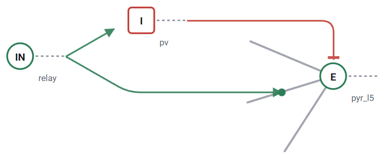
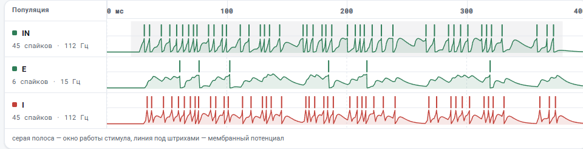
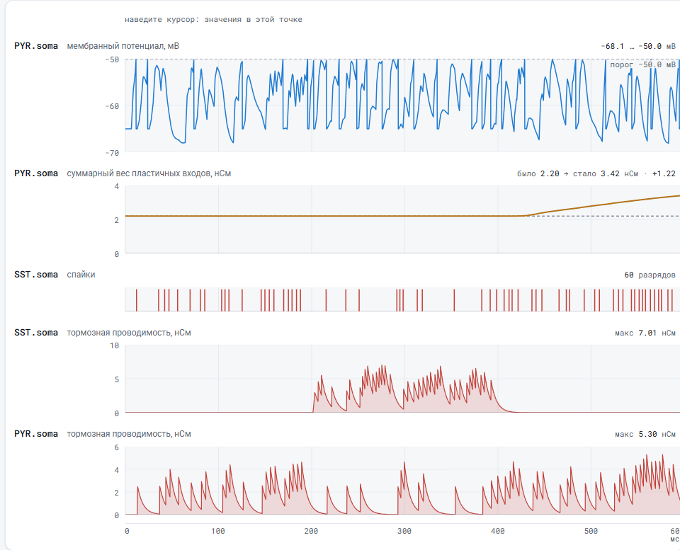
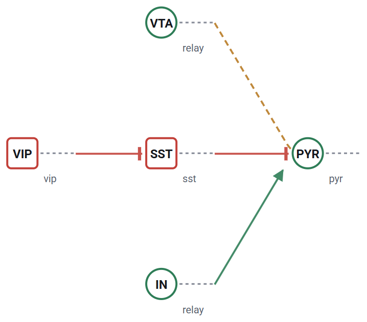
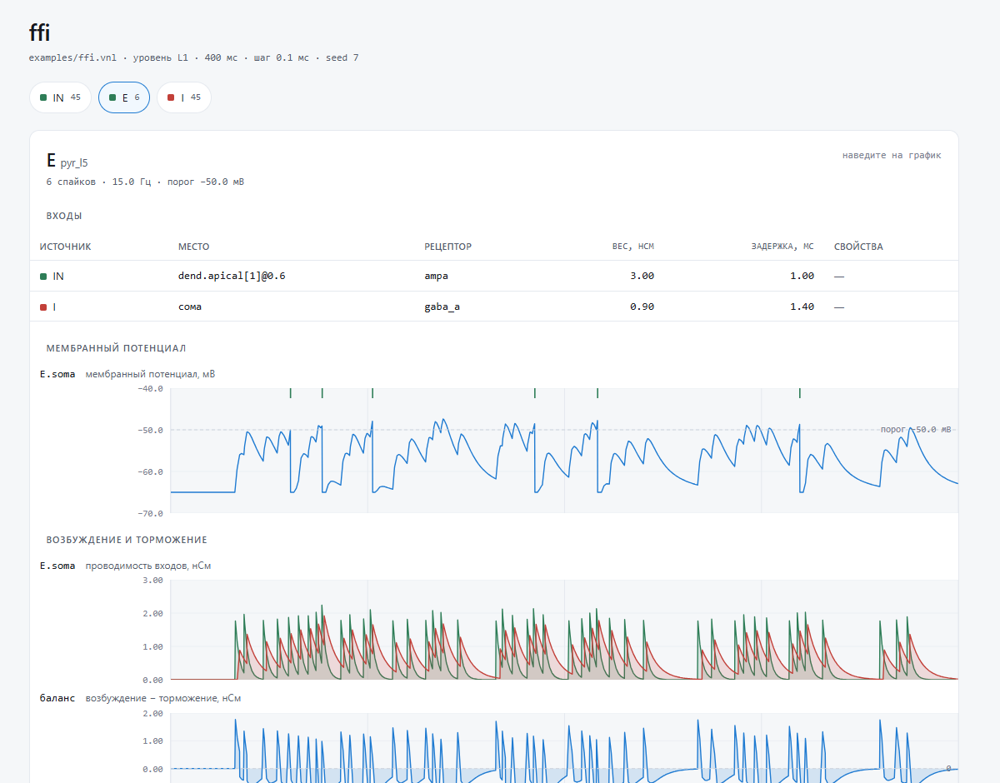
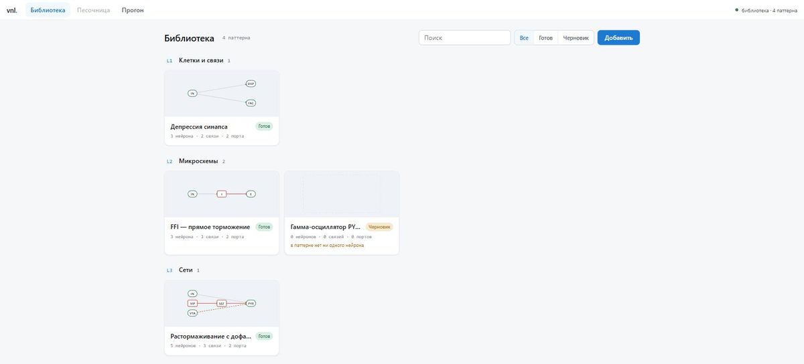
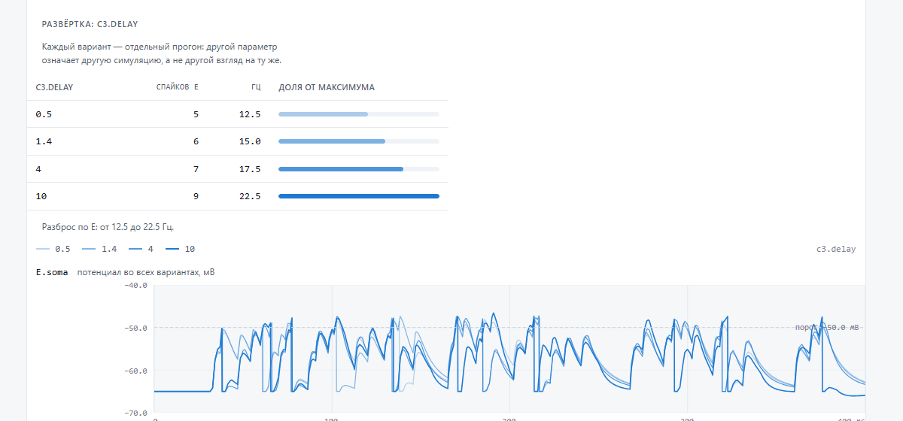

# VNL — язык описания нейронных микросхем

[English](README.md) · **Русский**

Модель пишется текстом. Файл `.vnl` разбирается в IR, а IR уходит в бэкенды:
точечный симулятор для быстрой работы и скрипт NetPyNE/NEURON для биофизики.
Свой солвер уравнений Ходжкина–Хаксли не пишется и писаться не будет.

```
   .vnl  ──►  AST  ──►  IR  ──┬──►  L1: точечный симулятор (чистый Python)
                              ├──►  L2: скрипт NetPyNE → NEURON
                              ├──►  HTML: схема (раскладка ELK), растр, трассы
                              ├──►  JSON ──► интерфейс (React, ui/)
                              └──►  граф в DOT
```



Всё на картинке нарисовано из исходника. Круг — возбуждающая клетка, квадрат —
тормозная. Слева веером отходят дендриты, справа пунктиром — аксон. Зелёная
точка на ветви стоит там, куда сел контакт: `E.dend.apical[1]@0.6`. Красная
плашка у сомы — торможение.

## Запуск

```bash
pip install -e .[dev]

vnl check  examples/ffi.vnl
vnl run    examples/ffi.vnl --traces out.csv
vnl view   examples/ffi.vnl --open          # схема, растр и трассы в браузере
vnl export examples/ffi.vnl -o ffi.netpyne.py
vnl graph  examples/disinhibition.vnl -o circuit.dot
```

`vnl run` печатает растр прямо в терминал:

```
IN ......|.|.|||||.||||.|.||||.|..||||||..|||.||.|....|.|.||||.|||.|....|.||.....
 E ...........|..|....|................|.....|...................|...............
 I ......||.||||||.||.|..||.||.|...||.||..||||||.|.....||.||||..||.|.....|||.....
   0                                                                      400 мс
```

## Страница прогона

`vnl view` собирает один самодостаточный HTML-файл: его печатают, кладут в
задачу, открывают без всего. Скриптов в нём нет, только SVG и CSS. Три блока —
схема, активность сети и трассы.



Активность сети — обзорный экран: дорожка на клетку, штрихи спайков, под ними
мембранный потенциал, серой полосой окно работы стимула. Он растёт строками, а
не уплотнением, поэтому новая клетка не отнимает места у остальных.



В трассах у каждого вида записи своя подача. У потенциала линия порога, у
проводимости отсчёт от нуля и заливка, у веса — сколько было и сколько стало, у
спайков — штрихи вместо кривой.

Временная ось на странице одна. Тик «100 мс» в активности сети и в трассах
стоит на одной вертикали, поэтому блоки читаются друг под другом. Оформление
следует дизайн-системе Reckue (`design/reckue/`), есть светлая и тёмная темы.

### Раскладку считает ELK

Расставить клетки и развести связи — отдельная задача, и решать её вручную
незачем: самописные кривые сливаются уже на трёх контактах. `vnl.layout`
собирает граф с портами и отдаёт его [ELK Layered](https://eclipse.dev/elk/)
через Node, а `vnl.report` только рисует готовые ломаные.

ELK выбран из-за портов с `FIXED_POS`: они приводят связь ровно в ту точку
дендрита, где объявлен контакт. Graphviz с `splines=ortho` так не умеет.

```bash
npm install --prefix tools/layout elkjs
```



Тот же движок на цепочке VIP ⊣ SST ⊣ PYR. Янтарный пунктир — нейромодулятор, он
ведёт к тому контакту, которым управляет.

Без Node и elkjs всё работает по-прежнему: раскладка падает на встроенную
послойную, и страница это отмечает. Движок выбирается флагом
`--layout elk|builtin|auto`.

## Интерфейс

Там, где нужно разобраться в причинности, страницы мало. Интерфейс живёт в
`ui/` и говорит с локальным сервером:

```bash
vnl serve --ui ui/dist          # и то и другое одной командой
cd ui && npm install && npm run dev   # в разработке: Vite проксирует /api сюда
```

Симуляция здесь — среда с управляемым временем, а не расчёт с отчётом в конце.
«Запустить» пускает время и продолжает с текущего момента, «Пауза»
останавливает, «Сброс» начинает сначала. Схема при этом живёт: клетка заливается
по мере приближения к порогу и вспыхивает на разряде. Над каждой клеткой стоит
её заряд числом — доля пути от покоя до порога, где покой 0%, а порог 100%.
Заливка на трети и на двух третях читается одинаково, а вопрос обычно именно
такой; торможение же по ней вообще не видно: клетку увели ниже покоя, и число
показывает это отдельно — `↓24%`.



Таймлайн — история этой же симуляции. Дорожка на клетку, и в ней сразу спайки и
трасса: разряд и то, что к нему привело, надо видеть вместе. Наведение
показывает значения под указателем, а щелчок ставит время на выбранный момент —
движок откатывается туда по снимку состояния и встаёт на паузу, поэтому
продолжение считается из настоящего состояния той секунды, а не из последнего.

Щелчок — это попадание мышью: 400 мс на 700 пикселях дают 0.57 мс на пиксель, и
встать ровно на нужную миллисекунду им нельзя. Поэтому рядом с часами стоят
«−1 мс» и «+1 мс», и то же делают стрелки влево-вправо; с Shift шаг десять
миллисекунд. Шаг вперёд — это кадр: разряд, попавший внутрь шага, показан
сотней процентов, хотя мембрана к концу шага уже сброшена и по мгновенному
значению разряда не видно никогда. Прыжок курсором кадром не считается —
накопленное для показа там начинается заново, иначе перемотка зажигала бы
давние разряды как сегодняшние. Шаг назад показывает состояние, а не событие:
миллисекундой раньше разряда ещё не было.

Активность сети стоит на карточке отдельной панелью под схемой, в той же
широкой колонке: растр — главное, что показывают в движении, и в прежней
колонке схемы поле дорожек получало 494 пикселя из 670, где разряды соседних
клеток сливались в одну полосу. Вниз под обе колонки активность не переехала
нарочно: список нейронов, связей, драйва и записей справа вчетверо выше схемы,
и между схемой и растром встала бы полтысячи пикселей пустоты, а смотрят их
вместе.

Шкала времени называет конец прогона, а не последний круглый тик: на 340 мс
ряд 1-2-5 доводит подписи до 300, и растр выглядел так, будто прогон там и
кончился. Круглый шаг при этом остаётся круглым — «где 200 мс» обычный вопрос,
«где 204 мс» нет, — конец добавляется отдельной подписью.

Выбранная клетка открывается в инспекторе: чем она возбуждается и тормозится, с
каким весом, задержкой и рецептором, какие у неё порог, покой, постоянная
времени и адаптация, сколько спайков она дала и с какой частотой.

Так же выбирается и связь — щелчком по строке в списке или по самой линии на
схеме; выделение одно, и выбранное на схеме подсвечено в списке. В её панели
стоят рецептор, вес, задержка, откуда и куда (с участком и долей, если это не
середина сомы), а у контактов с кратковременной динамикой или пластичностью —
ещё и они: без этого `short_term_facilitation` на витрине неотличим от обычной
цепочки.

Рядом со связями и портами карточка показывает драйв и записи примера запуска —
словами и числами: «в `IN.soma` идёт пуассоновский шум 250 Гц весом 1.5 нСм с 20
по 380 мс», «запись: возбуждающая проводимость на `E.soma`». Половина
библиотеки держится именно на драйве — `short_term_depression` это пачка из
восьми спайков, `disinhibition` — окно `gate` на 200–400 мс, — а по схеме этого
не видно вовсе. Править на карточке по-прежнему нечего: это витрина, поля ввода
живут в песочнице.

Оттуда же в песочницу и ведёт кнопка «В песочницу»: паттерн ложится блоком в
тот проект, который человек откроет, — и не один. Вместе с блоком приезжают
драйв и записи этой самой карточки, настоящими стимулами и записями проекта,
нацеленными внутрь блока (`ffi/IN`), и параметры её прогона: те же 250 Гц, то
же зерно, та же длительность — прогон в песочнице даёт ту же картину, что на
карточке, вплоть до счётчиков спайков. Без этого переход был бы полупустым:
блок приезжает молчащим, и чтобы увидеть показанное на карточке, драйв
пришлось бы заводить руками заново. Невошедшего кнопка уводит ко входу — так
же, как вкладка «Песочница»: прятать её значило бы скрыть, что песочница есть.

Дорога есть и в обратную сторону: щелчок по строке в панели «Библиотека»
песочницы открывает карточку этого паттерна. В строке два намерения, и они
разведены: превью с именем ведут на карточку — посмотреть, что это за схема,
её числа, связи и драйв, — а «+» вставляет блок и с экрана не уводит. Видно это
до щелчка: строка подсвечивается целиком, как любая строка-ссылка, а «+»
остаётся отдельной кнопкой с рамкой поверх неё.

Карточка при этом знает, откуда пришли: первая крошка называется
«Песочница» и возвращает в тот же проект — с теми же несохранёнными правками и
той же историей отмены. Терять их некуда: проект живёт в состоянии песочницы и
в открытом `Project` на сервере, а уход с экрана его не трогает; перечитывать
его на возврате никто не пробует — перечитанный с диска проект как раз и был
бы потерей. Не переживает перехода только открытая сессия симуляции: она
принадлежит схеме и закрывается вместе с экраном, а «Запустить» соберёт сеть
заново.

Правила «стимулы не переезжают при вставке блока» это не отменяет. Кнопка «+»
в панели «Библиотека» по-прежнему кладёт молчащий блок, и схема честно говорит
«нечем спайкать»: там просьба другая — «дай кусок схемы в мою сеть», — и чужой
драйв спорил бы с тем входом, ради которого блок и ставят. Витрина едет только
этой дорогой, по явному действию человека, и едет экспериментом проекта, а не
частью схемы: её правят панелью свойств и убирают, как любой другой стимул, а
в снимок блока она не попадает. Отдельной кнопки «Fork» на карточке нет и не
будет: правимая копия паттерна — это и есть блок в песочнице (снимок правится
на месте, «Разобрать на клетки» распускает его в схему, «Сохранить как
паттерн» кладёт получившееся обратно в библиотеку), а вторая дорога дала бы
библиотечную запись, отличную от оригинала только именем.

Собрано на Vite и React, без Next: локальному инструменту не нужны ни SSR, ни
серверный роутинг. Формат обмена описан в `src/vnl/api.py`, зеркало для
TypeScript — в `ui/src/model/types.ts`. Менять их можно только вместе.

### Библиотека паттернов

Готовая микросхема сохраняется паттерном, а потом вставляется в другую схему
блоком с портами. Библиотека и песочницы лежат файлами в `.vnl/`, и интерфейс
говорит с ними через локальный сервер:

```bash
vnl serve                        # библиотека на http://127.0.0.1:8765
cd ui && npm run dev             # интерфейс проксирует сюда /api
```

Сервер собран на `http.server` из стандартной библиотеки и слушает только
`127.0.0.1`. У ядра нет зависимостей, и это свойство дороже удобной валидации:
`pip install -e .` ставит инструмент целиком. Собранный интерфейс сервер отдаёт
сам — `vnl serve --ui ui/dist --open`.

На своей машине входа нет и не нужно: до порта на `127.0.0.1` никто не
дотянется. Общий стенд — другое дело, там сервер стоит за nginx, и тот ходит к
нему с `Host: localhost`, то есть проверка `Host` пропускает всех. Для такого
случая есть вход через Reckue auth (OIDC, `vnl/auth.py`): он включается пятью
переменными окружения и без них не включается вовсе.

```bash
VNL_OIDC_ISSUER=https://auth.reckue.com
VNL_OIDC_CLIENT_ID=...          # клиент регистрируется у провайдера
VNL_OIDC_CLIENT_SECRET=...
VNL_OIDC_REDIRECT_URI=https://vnl.reckue.com/auth/callback
VNL_SESSION_SECRET=...          # чем подписывается своя сессионная кука
```

Половины набора не бывает: с неполными настройками сервер не стартует, а не
поднимается «частично защищённым». Проверка подписи `id_token` своя, на `pow` —
зависимостей у ядра по-прежнему ноль.

Вход закрывает не всё. Библиотеку смотрят и трогают без учётной записи: каталог,
карточка паттерна, живая симуляция паттерна и словарь подписей (`/api/glossary`,
которым карточка называет рецептор и величину записи) открыты всем — это
витрина, и требовать вход, чтобы посмотреть схему, значило бы прятать её ни от
кого. Вход
нужен там, где начинается чужая работа и изменения: вся песочница, включая
чтение, создание и удаление паттернов, и состав хранилища (`/api/health`).
Граница живёт полем `Route.anonymous` рядом с методом и путём, и по умолчанию
маршрут закрыт — забытый маршрут оказывается закрытым, а не открытым.

Вошедший не значит «свой» (#520). Библиотека общая нарочно, а работа — нет: у
песочницы есть владелец (`Sandbox.owner` — `sub` учётной записи), в списке видно
только свои, а чужая не открывается и по прямому идентификатору. Отвечает она
при этом ровно то же, что несуществующая: 403 «есть, но не твоя» рассказывал бы
перебором, кто на стенде что завёл. Сессия симуляции делится так же, как
песочница, из которой её открыли; сессия паттерна не делится вовсе — карточку
смотрят по ссылке и без входа.

Проверка владельца стоит не у маршрутов, а у двери в песочницу — в
`Api._project` и `Api._live`. Полем у маршрута (как `anonymous`) её пришлось бы
повторить три десятка раз, а цена одного забытого поля — чужая работа
нараспашку; мимо `_project` же не пройти, потому что без него в руках не будет
проекта. Вход остался в таблице: она отвечает на «нужна ли учётная запись», а
владелец — на «чья это вещь», и это разные вопросы.

Песочницы, заведённые до появления владельцев, остались общими: видны и правятся
всеми вошедшими, как раньше, и помечены в ответе `shared`. Отдать их первому
вошедшему нельзя — он не обязательно их автор, — а спрятать до разбора значит
ничем не отличаться от «стёрли». Новые ничейными не бывают, поэтому список общих
со временем только тает.

У живых симуляций есть предел (#517). Сессия — это модель в памяти, все
накопленные трассы и считающий поток, а закрытая вкладка `DELETE /api/sim/<id>`
не шлёт: без предела пул растёт, пока не кончится память, и считает прогоны, на
которые никто не смотрит. Правил два, и они про разное. **Срок простоя**
(`VNL_SIM_IDLE`, по умолчанию 15 минут) — сторож закрывает сессию, о которой
давно не спрашивали: брошенная вкладка перестаёт жечь ядро, даже если на стенд
больше никто не пришёл. **Предел числа** (`VNL_SIM_LIMIT`, по умолчанию 16)
ограничивает память и число потоков сверху, чего срок простоя не делает —
пятнадцати минут хватит, чтобы открыть сколько угодно сессий.

Кого вытеснять, решает время последнего вопроса о сессии. Не время открытия:
открытая первой — не значит брошенная. И не происхождение: заброшенная песочница
ничем не лучше заброшенной витрины, а живая витрина ничем не хуже живой
песочницы; вопрос один — смотрит ли кто-нибудь. Сессию, о которой спрашивали в
последние пять минут, предел не трогает вовсе: если все живые кому-то нужны,
отказ получает новый (503 «попробуйте через минуту»), а не тот, кто работает.
Отказ обратим — человек повторит; отнятые трассы и поданное в них не вернуть.

Что видит интерфейс. Закрытая сессия отвечает 404 и называет причину — «её
вытеснила новая» или «её долго не спрашивали», — а экран показывает этот текст
рядом с транспортом и предлагает открыть прогон заново. Без причины на том же
месте было бы «сессии нет», то есть поломка на вид.



Каталог сгруппирован по ступени разбора: L0 — простейшие схемы, L1 —
взаимодействие сигналов, L2 — вычислительные примитивы, L3 — сети, L4 —
обучение и память, L5 — reference circuits. Это не масштаб конструкции, а
порядок чтения: что надо понять раньше, чтобы понять следующее. Ступени для
механизмов здесь нет — свойство одного контакта или одной клетки не схема, и
место ему в палитре примитивов, как уже случилось с одиночными клетками
(`vnl/cells.py`). Черновик виден черновиком и говорит, чего ему не хватает, а
не прячется до готовности.

Паттерн попадает в библиотеку из песочницы: схему собирают на холсте и
сохраняют кнопкой «Сохранить как паттерн», назвав порты -- точки, которыми
блок подключают снаружи. Завести пустой паттерн прямо в библиотеке нельзя, и
это решение, а не пропуск: редактора тела схемы в карточке нет и не будет,
иначе схемы рисовались бы в двух местах по двум разным правилам.

Поиск и фильтры считает Python (`vnl/catalog.py`), а не React: те же операции
получит Claude через MCP, и вторая реализация слова «подходит» разошлась бы с
первой незаметно. Миниатюра в каталоге рисуется из схемы паттерна, а не лежит
картинкой рядом, поэтому отстать от начинки она не может: янтарный пунктир на
ней — тот же нейромодулятор, что и на большой схеме.

### Палитра клеток

Рядом с библиотекой — третья вкладка «Клетки»: каталог типов
(`vnl/cells.py`, `GET /api/cells`), из которого на холст кладут отдельную
клетку. Это не раздел библиотеки, потому что клетка не разновидность паттерна:
портов у неё нет — соединяется она точкой на себе, внутренностей нет — нечего
разворачивать и форкать, зато есть параметры мембраны, которых у блока из трёх
нейронов не бывает. Ни ступень разбора, ни статус готовности к клетке не
применимы, и в фильтрах каталога она была бы ровно тем смешением, из-за
которого одиночные клетки однажды уже убрали из библиотеки.

Встроенный набор — пирамида, PV, SST, VIP и релейная — существует сразу после
`pip install`: пустая библиотека паттернов это просто пустая библиотека, а
пустой каталог клеток означал бы, что на холст нельзя положить ничего. Свои
типы кладутся из модели и перекрывают встроенные по имени:

```bash
vnl cell add моя.vnl --name "Быстрая пирамида"   # объявления cell -> в каталог
vnl cell list                                     # что сейчас в палитре
```

Фигура на холсте та же, что в миниатюре каталога: возбуждающая клетка
скруглённая, тормозная квадратная — разница читается и без цвета. Тормозной
клетку называет сервер (`ir.is_inhibitory_cell`), интерфейс только рисует.
В собранной сети клетки блока идут с приставкой (`ffi/E`), а положенные
вручную — своим именем: они и есть объекты схемы.

Под каталогом — второй раздел, «В проекте»: типы клеток, которые уже лежат в
этой песочнице, но каталогу не принадлежат. Они попадают туда из разобранного
блока (`patterns._adopt_type`) — так в проекте появляется `target`, которого в
каталоге нет и не будет, пока его туда не положили. Раньше такой тип наружу
отдавался только внутри `pointModel` конкретной клетки: человек разбирал
паттерн, видел на холсте клетки `target` и не мог положить третью такую же,
хотя тип уже был в его проекте.

Разными списками, а не одним: у каталожной клетки есть человеческое имя и
объяснение, а у типа из паттерна только идентификатор, и в общем списке
пришлось бы либо выдумать `target` имя, либо погасить имена у половины строк.
Вместо объяснения в строке стоит то, что про такой тип вообще известно:
медиатор, порог и сколько клеток этого типа уже в проекте — последнее заодно и
предупреждение, потому что параметры мембраны висят на типе и правка порога
задевает всех. Положенная клетка берёт **существующий** тип, а не его копию,
поэтому три `target` остаются тремя клетками одного типа.

Одноимённые каталогу типы в этом разделе не повторяются: кнопка «+» каталожной
строки кладёт клетку, а песочница оставляет уже лежащий в ней тип на месте —
обе строки сделали бы буквально одно и то же.

Под строкой типа — «в каталог» (`POST /api/cells`): дорога наружу, чтобы
`target` не оставался заперт в одном проекте. Это форма, а не кнопка, и
спрашивает она ровно то, чего у типа из паттерна нет, — человеческое имя и
объяснение. Оба обязательны: каталог без `note` — это список слов, по которым
не выбрать, то есть ровно то состояние, из которого палитру выводили.
Столкновение с уже лежащей клеткой — отказ, который называет её по имени;
перекрыть встроенную пирамиду своей по-прежнему можно, но подтверждением, а не
молча. В каталог уезжает копия: правка порога в песочнице каталожную запись не
трогает, и наоборот.

### Одна схема — один вид

Изображений одной и той же схемы в интерфейсе несколько: строка библиотеки в
песочнице, миниатюра каталога, начинка раскрытого блока, объекты на холсте,
схема карточки паттерна. Долго они расходились — и разница видна глазами:
человек разглядывал внутри коробки схему слоями, жал «разобрать на клетки» и
получал ту же схему сеткой, другими кривыми и другими знаками на концах.
Эталоном выбрана библиотека: там читается, значит остальное подгоняется под
неё, а не наоборот.

Сведено оно так:

- **места**. Послойная расстановка (слой — глубина по связям) живёт в одном
  месте, `ui/src/lib/miniature.ts`, и оттуда же берутся места клеткам при
  разборе блока — только шагом холста, а не полем карточки: фигура клетки на
  холсте 74x38, а в миниатюре 28x20, и переносить пиксели один в один нельзя.
  Переносится строение — кто в каком слое и в каком ряду;
- **кривая**. Связь — квадратичная дуга, у которой изгиб подбирается перебором
  по штрафу: задел за чужую фигуру дороже всего, выход за поле дешевле, лишняя
  кривизна дешевле всего (`arc` там же). Её же рисует провод холста
  (`ui/src/lib/wire.ts`). Прежде сторона была прибита к роли конца — источник
  отдаёт справа, цель принимает слева, — и связь справа налево была обязана
  выйти вправо, развернуться и прийти слева, то есть обогнуть оба узла снаружи;
  в схеме с возвратом таких связей половина. Дуге выбирать сторону не из чего
  вовсе: она выходит там, где граница фигуры смотрит на изгиб, и возврат
  получается такой же короткой дугой, что и прямая связь;
- **знаки на конце**. Остриё у возбуждения, плашка у торможения, янтарный
  пунктир у модуляции — описаны один раз (`ui/src/lib/marker.ts`) и всюду
  одинаковы. Остриё, а не точка: точка симметрична и о направлении не говорит,
  и `A→B` с `B→A` по ней выглядели одинаково.

Два случая холсту нужны сверх миниатюры, и оба названы в коде. Связь клетки на
себя: оба конца в одной точке, изгибать нечего — рисуется петлёй у самой
фигуры. Порт: он нарисован кружком на своём краю коробки, и провод обязан
прийти именно туда — отдельной ветки это не требует, у порта нулевые
полуразмеры, и точка на границе такой фигуры есть она сама.

Поле, за которое дуге лучше не выходить, у миниатюры задано макетом карточки, а
на холсте это общий прямоугольник схемы: фигуры там кладёт человек.

### Блок — не чёрный ящик

Блок на холсте раскрывается: видна его начинка теми же обозначениями, что в
миниатюре каталога, и к любому внутреннему нейрону можно вести связь, минуя
порт. Это не послабление, а признание того, что уже так и считается: чёрный
ящик — способ показать блок, а не способ его посчитать, и при сборке нейроны
экземпляра разворачиваются в общую сеть с приставкой (`ffi/IN`, `ffi/E`,
`ffi/I`). Связь внутрь — обычный контакт между настоящими точками:

```
X -> ffi/I     # тормозный нейрон внутри блока, порт для этого не нужен
```

Порт остаётся и работает как раньше. Он названная автором точка подключения,
удобный ярлык частой двери, — но не единственная дверь: порты выбирают один
раз, а схему потом используют по-разному. От feed-forward inhibition берут
тормозный нейрон, а входной релей не нужен вовсе, и порта под каждый такой
случай автор объявить не может.

Правятся у блока не только клетки, но и контакты внутри него: рецептор, вес и
задержка — теми же тремя полями, что у связи на холсте, потому что вещь одна и
различается только адрес. Без этого механизм нельзя было потрогать там, где он
живёт: в «задержке проведения» весь смысл в двух контактах одного источника,
`delay = 1 мс` и `delay = 10 мс`, а поменять их можно было только переписав
`.vnl` и переложив схему заново. Правка идёт в снимок экземпляра
(`PATCH /api/sandboxes/<id>/objects/<блок>/contacts/<контакт>`), поэтому она не
задевает ни такой же блок рядом, ни паттерн в библиотеке — ровно так же, как
уже устроен порог.

Раскрытие живёт только на экране (`ui/src/state/sandbox.ts`). На сервер оно не
уходит: попади оно в песочницу, щелчок по знаку делал бы проект несохранённым,
а отпечаток собранной сети — устаревшим. Отпечаток считается по модели, и
раскрытия в ней нет.

О том, что блок раскрывается, коробка говорит сама. Сперва не говорила: знаком
раскрытия был кружок с плюсом в углу подписи — такой же кружок, каким рядом
нарисованы порты, — и владелец, ради которого раскрытие и делалось, прочёл его
как «добавить порт» и не нашёл ни начинки, ни связи во внутренний нейрон.
Поэтому кнопкой стал сам счётчик «3 кл. · 2 св.» внизу коробки: он и так
говорил, что внутри что-то есть, — теперь он ещё и зовёт туда заглянуть, а
подсказка досказывает, что к любой из этих клеток можно вести связь мимо
портов. Кружок при этом остался значить ровно одно — порт. Двойной щелчок по
коробке делает то же, что кнопка: кнопку находят глазами, двойной щелчок —
рукой. Возможностей от этого не прибавилось: и раскрытие, и разбор — те же
операции, что были.

Блок и разбирается: «Разобрать на клетки» заменяет коробку её же клетками,
связями и типами — обычными объектами песочницы. Операция обратная сборке, и
половина её давно написана: `compose` разворачивает блок в общую сеть на каждом
запуске, `extract_pattern` собирает паттерн из выбранного. Нужна она там, где
от паттерна нужна половина или его надо переделать на месте: `fork` на этот
вопрос не отвечает — он кладёт правимую копию в библиотеку, а речь про этот
проект. Имена клеткам раздаёт тот же `free_id`, что и блокам, — разбор не
затирает уже лежащее в проекте; типы копируются глубоко, иначе правка порога
после разбора молча поменяла бы соседний блок того же паттерна; связи, стимулы
и записи, смотревшие в порт, переписываются на точку соответствующей клетки.
Сеть от этого не меняется: при том же зерне прогон до и после разбора совпадает
спайк в спайк, а «Отменить» возвращает блок целиком одним шагом.

Места клеткам при разборе считает интерфейс и присылает готовыми — как и у
«Разложить»: внутри коробки схема была разложена слоями, и после разбора она
обязана стоять так же. Сервер их только применяет; без них (командная строка,
старый клиент) остаётся запасная сетка `_around`, которая про связи не знает
ничего и умеет лишь не свалить клетки в кучу.

Дорог к разбору две. Кнопка в панели свойств — место, где блок правят целиком;
плашка «разобрать на клетки» под выбранным блоком на холсте — место, где его
выбирают. Только панелью обойтись не вышло: узнать о разборе из неё можно,
уже выбрав блок и доскроллив до низа, а смотрят с первой секунды на холст.
Плашка висит под одним выбранным блоком, а не под каждым: иначе схема из
десяти блоков превратилась бы в список кнопок. И там, и там сказано одно и то
же: блок перестанет быть блоком, останутся столько-то клеток и связей,
отменяется одним шагом.

Идентификатор блока — адрес, а не подпись. Берётся он от `pattern.id`
(`ffi`, `ffi2`), а не от человеческого имени: из имени «Торможение с
опережением (feedforward inhibition, FFI)» получался адрес длиной в строку, а
им подписаны и связи, и каждый внутренний узел. Подпись на холсте при этом
остаётся человеческой — её правят, адрес нет: за него держатся связи, стимулы
и записи.

### Холст — окно, а не картинка

Холст показывает не всю схему, а её кусок: `viewBox` следует за областью, и
единица холста — пиксель экрана при приближении «один к одному». Раньше он был
жёстким `760x420`, который вписывали в область с сохранением пропорций, и из
этого следовали две беды сразу. Схема меняла размер, когда тянут границу
нижней панели «Активность сети»: место объектов то же, а вся картинка едет.
И за пределами `760x420` ничего не существовало — ни прокрутки, ни
приближения, так что схема из двадцати клеток не помещалась вовсе.

По схеме ходят колесом: голое колесо прокручивает, Shift с колесом — вбок,
Ctrl с колесом приближает вокруг курсора. Те же жесты, что на таймлайне: два
разных способа приближать в одном экране — это жест, значение которого зависит
от того, над чем держат курсор, а этого человек не помнит. Пустое место холста
вдобавок тянется мышью — тот же жест, которым двигают объекты, только
двигается бумага под ними. В углу стоит приближение числом, и оно же кнопка
«вписать»: уехав в угол схемы из двадцати клеток, назад по щелчку колеса не
вернёшься.

Приближение и прокрутка — показ, как и раскрытие блока: живут в состоянии
экрана (`ui/src/state/sandbox.ts`), на сервер не ездят, `dirty` не поднимают,
`fingerprint` не трогают и прогон не старят. Место объекта при этом остаётся
частью проекта и от приближения не меняется: перевод «пиксели → единицы
холста» один и тот же и в отрисовке, и в перетаскивании, поэтому объект идёт
ровно за курсором на любом приближении.

Туда же, в окно, смотрит размещение нового объекта: прежняя сетка «три в ряд
от нуля» после десятка клеток клала следующую за краем окна — то есть нигде.
Теперь сколько мест в ряду и сколько рядов, решает само окно, а когда они
кончаются, начинается заход, сдвинутый по диагонали. Сетка при этом остаётся
грубой прикидкой «куда положить»: разложить схему по-настоящему умеет
«Разложить».

### Разложить схему

Клетки и блоки стоят там, куда их положили: новый объект получает место по
простой сетке в видимой части холста, дальше всё двигают руками. Для трёх клеток это терпимо, для
пятнадцати — нет, и на холсте есть кнопка «Разложить»: она расставляет объекты
по слоям тем же ELK, каким разложена схема на карточке паттерна и миниатюра в
каталоге (`ui/src/lib/place.ts`, один вызов движка на всех — две настройки
разошлись бы незаметно).

Считается раскладка в браузере, а применяется проектом. Считается там, потому
что раскладывается то, что видно: размер узла — настоящий размер фигуры на
холсте (свёрнутый блок 150x62, раскрытый 236x152, клетка 74x38), а раскрытие
блока вообще живёт только на экране. Одинаковые квадраты вместо фигур дали бы
раскладку не этой схемы: ELK разводит узлы по габаритам.

Применяется проектом, потому что место объекта — часть проекта, а не показ:
`POST /api/sandboxes/<id>/arrange` отдаёт готовые места `Project.arrange`, и та
меняет их одним пакетом (`batch`). Поэтому «Отменить» возвращает прежние места
целиком, а не по узлу, а отпечаток собранной сети не меняется — место на физику
не влияет, и прогон от раскладки не стареет.

Раскладка — по требованию, а не на каждую вставку: человек расставил объекты по
смыслу, и новая клетка, перетасовавшая бы всю схему, отняла бы у него эту
работу.

### Имя, копия и Delete

Объект на холсте переименовывается, дублируется и убирается клавишей — тем же,
чем это делают везде. `Delete` и `Backspace` убирают выбранное, Ctrl+D делает
рядом второй такой же, и подтверждения ни то ни другое не спрашивает:
«Отменить» одношаговое и возвращает объект вместе со связями, стимулами и
записями, которые на нём висели. Со стрелками, которые шагают по времени, и с
Ctrl-колесом, которое приближает, эти клавиши не спорят, а в поле ввода
молчат: там `Delete` стирает букву.

Имя блока и имя клетки — разные вещи, и правятся они разными полями. У блока
это подпись на коробке: в собранной сети самого блока нет, в неё
разворачиваются его нейроны (`ffi/E`), и подпись не адресует ничего — одного
«FFI» из библиотеки на схеме бывает три, и различать их надо на холсте. У
отдельной клетки наоборот: её имя и есть имя нейрона в собранной сети — им
подписан столбец растра, им зовётся трасса, за него держатся связи, стимулы и
записи.

Поэтому у клетки не заведено второй, «человеческой» подписи рядом с адресом:
панель свойств звала бы клетку «Вход», а растр под тем же экраном — `relay2`,
и два имени одной вещи на одном экране хуже, чем одно неудобное.
Переименование сделано операцией, которая чинит ссылки разом
(`patterns.rename_neuron`): связи, стимулы, записи и источники модулятора
переезжают на новое имя за один шаг отмены. Внутренние адреса блока (`ffi/E`)
она не задевает — это блок, а не клетка, и косой черте в имени клетки места
нет.

Копия получает свободное имя (`relay2` даёт `relay3`, а не `relay22`), те же
параметры мембраны и место рядом. Связей и драйва копия не получает: связь без
второго конца бессмысленна, а копия стимула била бы в ту же клетку вторым
входом — это другая схема, а не второй такой же объект. Клетка при этом берёт
существующий тип, а не его двойник: параметры мембраны в IR висят на типе, и
правка порога обязана задевать обеих. Блок наоборот берёт копию снимка — за
снимок экземпляра и держатся, чтобы два блока одного паттерна расходились
свободно.

Имя проекта правится там же, в панели свойств, рядом с параметрами прогона:
это свойство проекта, и снимать ради него выделение с блока незачем. Чинить
после него нечего — идентификатор проекта отдельный (`sandbox.id`), за него
держатся файл в хранилище и открытая сессия. Отпечаток собранной сети от имени
проекта не зависит: имя — подпись на результате, а не сеть, и прогон от
переименования не стареет.

### Стимул виден у той клетки, куда он бьёт

Стимул и запись — самостоятельные объекты: у них своя жизнь, их правят и
убирают, и в дереве «Объекты» у каждого своя строка. Но цель у стимула ровно
одна, и смотреть на него человек хочет оттуда, куда он бьёт: вопрос «почему
эта клетка спайкает пачками» задают, глядя на клетку, а не разыскивая
`drive2` в списке.

Поэтому в свойствах выбранной клетки — и выбранного блока — стоит раздел
«Драйв и записи»: что на неё подаётся, какого рода, с какими числами и в каком
окне, и всё это правится на месте. Там же заводятся новые. Отдельные строки в
дереве объектов остались: у объекта есть имя, и убрать его оттуда значило бы
спрятать то, что существует; строка открывает ровно те же поля — набор полей
один (`DriveFields`), а вторая его копия разошлась бы с первой на первом же
новом роде драйва.

Выделение при этом остаётся одно на экран. Драйв, показанный в свойствах
клетки, не делает «выбранными» два объекта сразу: показаны поля, а выбранной
остаётся клетка.

Каждый стимул — свёрнутая группа, как типы клеток и контакты блока: полей у
него до восьми, и три развёрнутых стимула превращают панель в простыню, где не
найти ни мембрану, ни кнопку. В сводке стоит протокол словами — «поезд, 8
импульсов, 20 Гц», — и он читается, не раскрывая ничего. Единственный стимул
раскрыт сразу: человек, выбравший клетку с одним драйвом, спрашивает именно
про него, и экономить тут нечего; как только их двое, оба сворачиваются.

Блоку принадлежат и драйв на порт (`ffi.in`), и драйв на внутренний узел
(`ffi/I`) — это одна точка, названная с двух сторон, и разводить их значило бы
объявить их разными вещами. Заодно на внутренний узел теперь можно подать драйв
прямо из списка «Внутри»: сервер принимал такой конец связи всегда, но
повесить на него стимул было нечем, и на тормозный нейрон блока — ради
которого паттерн чаще всего и вставляют — приходилось идти кругом. Щелчок по
самой строке по-прежнему ведёт соединение: два действия в одном щелчке
различить нельзя, поэтому у драйва своя кнопка.

## Развёртка параметра

«А что будет, если подвинуть задержку» одним прогоном не ответить: другой
параметр — другая симуляция. Развёртка клонирует модель, меняет в копии один
параметр и считает каждую копию отдельно.

```bash
vnl data examples/ffi.vnl --sweep "c3.delay=0.5,1.4,4,10"
```



Крутится вес, задержка и реверсал контакта, вложенные `dynamics.*` и
`plasticity.*`, параметры типа клетки. Список полей явный, поэтому опечатка в пути ловится
сразу и называет, что есть в модели. На `ffi` видно окно интеграции: чем позже
приходит торможение, тем больше спайков успевает дать пирамида.

## Язык

```
morphology pyr {
    soma           len=20um  diam=20um
    dend.apical[3] len=200um diam=2um  lambda=250um
    axon           len=500um diam=1um
}

cell pyr_l5 : excitatory, glutamate {
    morphology = pyr
    tau_m      = 15ms
    threshold  = -50mV
    adaptation = 1.5mV
}

neuron E : pyr_l5
neuron I : pv

I.axon -> E.dend.apical[2]@0.72 {
    receptor   = gaba_a
    weight     = 1.6nS
    delay      = 1.4ms
    depression = { u = 0.3, tau_rec = 120ms }
    plasticity = stdp_rl { tau_eligibility = 500ms, modulator = dopamine }
}

modulator dopamine : dopamine from VTA { gain = 1.0  tau = 200ms }

stim drive -> IN.soma : poisson rate=250Hz weight=1.5nS start=20ms stop=380ms
record E.soma.v
run { dt = 0.1ms  duration = 400ms  level = L1  seed = 7 }
```

Числа пишутся с единицами (`ms`, `nS`, `um`, `mV`, `Hz`, `nA`); внутри IR всё
приводится к мс / нСм / мкм / мВ / Гц / нА.

Записывать можно `v` (потенциал), `g` (суммарная проводимость), `g_exc`,
`g_inh` и `g_shunt` (возбуждение, торможение и шунт врозь — в сумме их баланс
пропадает), `w` (суммарный вес пластичных входов) и `spikes`.

### Заявленное число проверяется прогоном

Схема из библиотеки доказывает себя числом: «выход пирамиды падает с 13 спайков
до 6», «пики `g` падают с 0.685 до 0.055 нСм». Пока такое утверждение живёт в
комментарии, оно держится на доверии — движок меняется, число остаётся, и
расходятся они молча. Поэтому утверждение пишется оператором `expect` и
сверяется прогоном:

```
expect {
    E.spikes  = 6
    IN.spikes = 45
    PYR.spikes = 12  start=200ms stop=400ms
    NEAR.first_spike = 24.4ms
    E.soma.g_exc.max = 2.09nS
    DEP.soma.g.peak  = 0.685nS  index=1
    EN.soma.v.max    = 24.63mV  base=-65mV start=700ms stop=1100ms
    EN.soma.v.time_above = 65.7ms  level=-50mV start=700ms stop=1100ms
    sweep "c3.weight=0,0.3,0.9" E.spikes = 13, 11, 6
}
```

С растра снимаются `spikes`, `first_spike`, `last_spike`, `first_isi` и
`last_isi`; с трассы — `max`, `min`, `mean`, `final`, `peak` (номером `index`) и
`time_above` (уровнем `level`). Окно задают `start` и `stop`, отсчёт «над
покоем» — `base`. Ряд чисел бывает только у развёртки: там утверждение и есть
ряд.

Допуск берётся из самого числа: `2.2nS` — утверждение про десятые, `2.2000nS` —
про десятитысячные. Нужен другой — пишется рядом (`tol=0.1mV`), а не общим
послаблением в коде проверки, которое сняло бы строгость сразу со всех чисел. У
счёта спайков допуска нет вовсе: спайк целый.

Расхождение называет паттерн и оба числа:

```
ffi: E.spikes ожидалось 6, получено 9
eligibility_trace: E_LONG.soma.w.final ожидалось 2.5171nS, получено 2.5178nS; допуск 0.0001nS
```

Ожидание на незаписанную величину — ошибка разбора, а не тихо пропущенная
проверка. В чужую сеть вместе с блоком числа не едут: это утверждение о
демонстрации, а не часть конструкции.

### Реверсал контакта: вычитание или деление

Реверсал у контакта берётся из реестра рецепторов, но его можно написать
руками — и это не украшение, а другая операция над входом:

```
I.soma -> E.soma {
    receptor = gaba_a
    reversal = -65mV      # вровень с покоем: шунт
    weight   = 1.2nS
}
```

`gaba_a` с реестровым реверсалом −70 мВ уводит мембрану от порога — из входа
**вычитают**. Тот же `gaba_a` с реверсалом на уровне покоя мембрану не двигает
вовсе, зато роняет входное сопротивление клетки — вход **делят**. Разница видна
числом: при драйве в восемь раз сильнее шунт оставляет ту же долю ответа, а
вычитание почти перестаёт работать (`examples/library/shunting_inhibition.vnl`).

Полярность контакта поэтому решается числом, а не именем рецептора, и исходов
у неё три: `exc` (реверсал не ниже порога), `inh` (ниже покоя) и `shunt`
(между ними). Каждый пишется в свою запись — `g_exc`, `g_inh`, `g_shunt`.
Шестого имени рецептора под шунт в реестре нет намеренно: имя говорит о белке,
а не о режиме, а `gaba_a` с хлорным реверсалом на уровне покоя — обычная
клетка, а не выдуманный рецептор.

### NMDA: проводимость, зависящая от потенциала

`nmda` — не медленная `ampa`. Её канал забит магнием, и вытолкнуть магний может
только деполяризация, поэтому проводимость считается с множителем
Джара—Стивенса `B(v) = 1 / (1 + [Mg]/3.57 · exp(−0.062·v))`: 0.06 у покоя
−65 мВ, 0.51 при −20 мВ. Вклад `ampa` с приближением к порогу убывает (движущая
сила `E − v` тает), вклад `nmda` растёт — и из этой положительной обратной
связи получаются две вещи, которых линейным синапсом не добиться ни при каком
весе:

* **порог по числу совпавших входов** — три совпавших входа не делают ничего,
  четыре дают ответ вдвое больше суммы одиночных;
* **плато** — вход длится один шаг, а клетка держится выше −50 мВ десятки
  миллисекунд (`examples/library/nmda_spike.vnl`).

Записанная проводимость (`g`, `g_exc`, `g_shunt`) у такой клетки — эффективная,
то есть та, что проводит сейчас: именно она растёт вместе с деполяризацией и
объясняет нелинейность на графике. У всех остальных рецепторов множитель равен
ровно единице, и их числа этим не меняются.

Регенеративный ток — прямой путь к расходимости явной схемы интегрирования,
поэтому солвер на каждом шаге проверяет условие устойчивости
`dt/tau_m · (1 + Σg) < 2` и при его нарушении отказывается считать, называя
клетку, момент и тот `dt`, при котором счёт сойдётся. Зажатая трасса вместо
отказа выглядела бы правдоподобно и была бы неправдой.

Экспорт в NetPyNE переносит `nmda` линейным `Exp2Syn` и пишет об этом в потери:
в NEURON у нас нет своего mod-механизма с блоком магнием, и молчать о том, что
скрипт считает другую сеть, нельзя.

Реверсал крутится развёрткой под тем же именем:

```bash
vnl data examples/library/shunting_inhibition.vnl --sweep "c1.reversal=-70,-67,-65,-62"
```

То же поле есть и у стимула, кроме `current`: инжекция тока проводимости не
открывает, и реверсала у неё нет — такая запись отвергается, а не проглатывается
молча.

### Протокол стимуляции вместо списка времён

Драйв бывает трёх первичных родов: `current` (постоянный ток в окне),
`poisson` (случайные моменты со средней частотой) и `spikes` (перечисленные
руками моменты). Поверх `spikes` лежат шаблоны протоколов — те, которыми
эксперимент называют вслух:

```
stim drive -> IN.soma : train   { n = 8, freq = 20Hz, recovery = 500ms, weight = 3nS }
stim probe -> IN.soma : pairs   { isi = 50ms, weight = 3nS }
stim zap   -> IN.soma : burst   { n = 4, freq = 100Hz, weight = 3nS }
stim tet   -> IN.soma : tetanus { freq = 100Hz, duration = 1s, weight = 3nS }
stim theta -> IN.soma : tbs     { bursts = 10, burst_period = 200ms, weight = 3nS }
```

Каждый разворачивается в тот же список времён, что написали бы руками:
`train { n = 8, freq = 50Hz, start = 50ms }` — это в точности
`spikes times="50 70 90 110 130 150 170 190"`, до последнего разряда того же
прогона. Поэтому `spikes` и остаётся первичным: на нём держится
воспроизводимость, а шаблон — сахар, а не замена. Числа шаблона можно не
писать вовсе — тогда берутся канонические (поезд: 8 импульсов на 20 Гц; пачка:
4 по 100 Гц; тетанус: 100 Гц в течение секунды; theta-burst: 10 пачек через
200 мс).

В отчёт протокол печатается словами — «поезд, 8 импульсов, 20 Гц, тест
восстановления через 500 мс», — а список моментов лежит рядом: одним отвечают
на «что это за эксперимент», другим на «когда именно придут импульсы».

### Сенсор и мотор: граница с миром

Драйв — витрина опыта: он задан заранее и весь лежит внутри прогона. Сеть при
этом ни на что не смотрит и ничем не шевелит: источника, который меняется
**снаружи**, и выхода, который снаружи читают, у неё нет. Это и есть сенсор и
мотор.

```
sensor key : rate { to = 100Hz }
key -> MN.soma { weight = 2nS }
motor out : rate { from = MN.soma, window = 50ms }
```

Через границу идут числа, а кодирование живёт внутри сенсора. Снаружи приходит
безразмерная величина от 0 до 1, и род решает, во что она превратится: `rate`
льёт поток импульсов с частотой, пропорциональной величине, — 1 это заданные
100 Гц, 0.5 половина, 0 тишина. Мотор превращает разряды клетки в число —
частоту за скользящее окно. Так схема сама рассказывает, как понимает мир, а
подключающемуся не надо знать про спайки.

Подключается сенсор обычной стрелкой, с весом и рецептором: он и есть вход,
только источник у него снаружи. Мотор смотрит на точку клетки, как запись, —
поэтому и адресуется он `from`, а не стрелкой: он ничего в клетку не вливает.

Величина живёт во времени: пришла единица — держится, пока не придёт ноль. Без
поданного значения сенсор молчит, а не выдумывает себе вход, и схема с
сенсором считается в одиночку — просто вход у неё нулевой. Подаётся значение
при запуске:

```bash
vnl run examples/sensor_motor.vnl                              # ничего не подано: MN молчит
vnl run examples/sensor_motor.vnl --sensor key=1               # держим: 28 спайков, мотор 100 Гц
vnl run examples/sensor_motor.vnl --sensor "key=1@100,0@200"   # нажали и отпустили: 9 спайков между 121 и 204 мс
```

`@` — момент модельного времени; настоящие секунды к прогону отношения не
имеют. Это запись значений, и на ней держится воспроизводимость: та же запись
даёт тот же прогон спайк в спайк, потому что поток входа — часть состояния
прогона, а не внешняя переменная.

Роды сенсора и мотора живут в одном реестре с родами драйва (`vnl/protocols.py`),
и это не экономия файла: для человека «чем сеть связана с миром» — один вопрос,
а два списка (один в Python, другой в браузере) разошлись бы молча. Род
объявляет и то, на что он отвечает: `rate` отвечает на уровень («держат
единицу — идёт поток»), а место для рода, отвечающего на изменение («нажали»,
«отпустили»), в реестре есть — прошлая величина доходит до рода вместе с
нынешней.

На L2 граница не переносится, и `vnl export` говорит об этом прямо: заранее
известных моментов у сенсора нет — в том и разница между ним и драйвом, — а
мотор это чтение растра, а не механизм.

### Живой вход в сессии

В сессии величину подают по ходу дела: `POST /api/sim/<id>/sensors` с телом
`{"key": 1}` — словарём, потому что две кнопки, нажатые разом, обязаны лечь на
один и тот же момент модельного времени. Момент сессия берёт у себя: «сейчас»
для прогона — это ближайший непосчитанный шаг, а не показания часов.

В ответе приходит полное состояние сессии, тем же куском, что клетки, трассы и
спайки: `sensors` — какая величина держится на текущем моменте, `motors` —
что сеть отдаёт сейчас, `input` — вся запись поданного целиком. Одним ответом,
потому что кнопку, лампочку и заливку клетки надо рисовать в одном кадре; двух
опросов хватило бы, чтобы кнопка отставала от растра. У схемы без сенсоров и
моторов этих полей нет вовсе — сессия отвечает ровно тем же, чем отвечала
раньше.

Перемотка, откат и шаг по миллисекунде продолжают работать: поток входа
переигрывается из записи, как переигрывается случайный драйв по состоянию
генератора. Перемотали на 150 мс и досчитали — картина повторяется спайк в
спайк; перемотали на 50 мс — сеть не видит значения, поданного на 100-й.

«Сброс» запись **не стирает**: он возвращает время к нулю, чтобы посчитать ту
же схему заново, и зерно генератора при этом не выбрасывает — поток входа
ведёт себя так же, иначе повторить опыт с кнопками стало бы нельзя ровно
тогда, когда это нужнее всего. Чистый лист при этом есть: новое нажатие
стирает записанное после своего момента будущее — взялись за кнопку, и прежнее
будущее перестало быть будущим этого прогона.

Отпечаток сети от нажатия не меняется и проект несохранённым не становится:
это вход, а не схема.

### Кнопки в песочнице

Та же граница с той стороны, где сидит человек: под холстом стоит полоса
кнопок. Кнопку заводят, дают ей имя и привязывают к сенсору или к мотору
собранной схемы — список дверей приходит с сервера вместе с состоянием
проекта, выдумывать его в браузере нельзя. Нажали — в сессию ушла единица,
отпустили — ноль, и пока держат, держится единица. Ползунков нет: вход
прототипа — бит.

Кнопка, привязанная к мотору, не нажимается вовсе: она лампочка и горит, пока
мотор отдаёт ненулевое, показывая его число с единицей от сервера. Клавиша —
второй способ нажать ту же кнопку: буква или цифра, назначенная при заведении;
стрелки остаются шагом по времени, `Delete` и `Ctrl+D` — объектом на холсте.

Горит кнопка по ответу сессии, а не по пальцу. Это видно на перемотке: вернулись
на 90 мс — кнопка, которую держали в тот момент, горит снова, хотя палец с неё
давно убрали, а на 300-й, где её уже отпустили, она темна. Своё «нажато» в
браузере врало бы ровно здесь.

Самих кнопок в проекте нет — они живут в браузере, по одному списку на проект.
Заведение кнопки не делает проект несохранённым и не старит прогон: кнопка
стоит с той же стороны границы, что и палец. Схема без сенсоров и моторов
полосы не получает вовсе и выглядит ровно как раньше.

Сенсор и мотор заводятся в панели свойств клетки, рядом с драйвом и записью:
вопрос один — чем эту клетку гонят и что с неё снимают, — и разница только в
том, что у границы одна сторона снаружи. «Сенсор на клетку» заводит дверь и
сразу тянет от неё стрелку: одинокий сенсор до клетки ничего не доносит.

### Два решения, на которых держится всё остальное

**Адресация контакта двухуровневая.** В исходнике стоит логический адрес
`E.dend.apical[2]@0.72`; резолвер превращает его в `(section, fraction)` — тот
самый кортеж, который понимают и NEURON (`sec(0.72)`), и NeuroML2
(`postSegmentId` + `postFractionAlong`). Логический адрес переживает смену
морфологии, разрешённый — нет, поэтому хранится первый.

**Обе стороны контакта — точки, а не клетки.** `pre` и `post` типизированы
одинаково, поэтому axo-axonic, axo-dendritic и axo-somatic контакты — один
механизм без спецслучаев.

### Ничего не теряется молча

При понижении уровня детализации параметры деградируют по явным правилам, и
каждое срабатывание попадает в отчёт:

```
деградация L2 -> L1:
  контакт c1: положение dend.apical[1]@0.6 (120 мкм от сомы) свёрнуто
  в вес x0.619 и задержку +0.60 мс
```

То же на экспорте. `vnl export` печатает список того, что NetPyNE не принимает
один в один: короткотечная динамика, сигнал нейромодулятора, остановка NetStim.
Это «скрипт плюс список потерь», а не молчаливое усечение модели.

То же и с драйвом, который до клетки не дойдёт:

```
предупр. [стимул s] подано будет 2 времени из 3: вне окна с 100 мс осталось 50.
  Окно отсекает написанные моменты, а не сдвигает их: у times моменты
  абсолютные, и start для них — граница, а не начало расписания.
предупр. [стимул s] 1 время за концом прогона 500 мс: 850 — прогон до него не доживёт
```

Второе — самый частый случай: тестовый импульс восстановления через 500 мс
после поезда 8×20 Гц приходит на 850 мс, а прогон по умолчанию 500 мс, и
половина протокола просто исчезала. Так же называются два момента, попавшие в
один шаг `dt`: их импульсы складываются в один двойной, и это сказано, а не
угадывается по амплитуде.

У пуассоновского драйва свой предел: розыгрыш кладёт не больше одного события
на шаг, то есть потолок рода — `1/dt`, при `dt = 0.1 мс` это 10 000 Гц. Просьба
о большем — отказ с числами, а не молчаливые 10 000 Гц; от `rate·dt/1000 = 0.1`
(1000 Гц при `dt = 0.1 мс`) — предупреждение: суммарное число событий
сохраняется, но совпадения внутри шага стимул выразить не может.

## Примеры

| Файл | Что показывает |
|---|---|
| `examples/ffi.vnl` | feed-forward inhibition; выход пирамиды падает с 13 спайков до 6 |
| `examples/disinhibition.vnl` | VIP → SST → PYR; вес пластичного входа стоит на месте до дофамина и растёт после |
| `examples/depression.vnl` | один и тот же вход на депрессирующий и фасилитирующий контакт |
| `examples/sensor_motor.vnl` | граница с миром: сенсор на входе, мотор на выходе |

## Что уже есть

- разбор `.vnl` и диагностика с указанием места и причины;
- морфология, логическая адресация, затухание и задержка по дендриту;
- L1: два вида точечной клетки -- LIF с адаптацией и адаптивный
  экспоненциальный (`point = adex`: разгон у порога и ток адаптации, то есть
  пачки и отдача после торможения), проводимостные синапсы, задержки,
  короткотечная динамика Цодыкса–Маркрама, парный STDP, STDP с подкреплением
  и модулятором;
- экспорт в NetPyNE со списком потерь и граф в DOT;
- страница прогона с раскладкой через ELK;
- развёртка параметра: несколько прогонов на одном экране;
- интерфейс на React: библиотека, карточка паттерна и песочница с управляемым
  временем, живой схемой, таймлайном и инспектором клетки;
- каталог типов клеток и палитра на холсте: схему можно собрать из отдельных
  клеток, не вставив ни одного паттерна библиотеки;
- паттерны, песочницы и хранилище: библиотека с поиском и локальный сервер
  для интерфейса;
- 399 тестов у ядра и 155 у интерфейса. Зависимостей у ядра нет: Node и ELK нужны
  только для картинки, React — только для интерфейса.

## Чего ещё нет

- **L2 не прогонялся.** Генератор NetPyNE проверен только на то, что скрипт
  компилируется и несёт правильные `sec`/`loc`. NEURON локально не стоит;
  первый настоящий прогон нужно делать в WSL или Docker.
- **Нормировка проводимости условная.** Вес в `nS` трактуется в единицах
  проводимости утечки (leak = 1 нСм), поэтому веса в примерах подобраны под L1,
  а не взяты из физиологии. При первом прогоне L2 масштаб придётся пересчитать —
  это ожидаемая правка, а не сюрприз.
- Схему нельзя редактировать мышью. Курсор времени на статической странице
  ходит только по трассам и не подсвечивает схему; чтобы он шёл сквозь все
  блоки, нужен скрипт на странице.
- Усреднение вокруг спайков входа осталось только в коде: на прежнем экране
  прогона оно было, в карточку и песочницу ещё не переехало.
- Развёртка параметра живёт в командной строке (`vnl data --sweep`), на
  экранах интерфейса её нет.
- Дендритный веер рисуется схематично и в раскладке участвует лишь габаритом:
  ELK обходит прямоугольник клетки, а не саму ветвь.
- Нет импорта `.swc`, экспорта в NeuroML2, редактора и уровня L0.

## Разработка

```bash
python -m pytest -q          # ядро
cd ui && npm test            # интерфейс
```

## Лицензия

Код проекта пока без лицензии, а это по умолчанию значит «все права защищены».
Если использование нужно разрешить — скажите, какую лицензию поставить.

Каталог `design/reckue/` — фирменные материалы Reckue, условия на них
отдельные: [design/reckue/LICENSE.md](design/reckue/LICENSE.md). Коротко: с ними
можно собирать и дорабатывать VNL, но не брать их в другие продукты. Код
обращается к переменным (`--ink`, `--accent`, `--exc`), а не к конкретным
цветам, поэтому в форке токены заменяются своими без правок кода.
